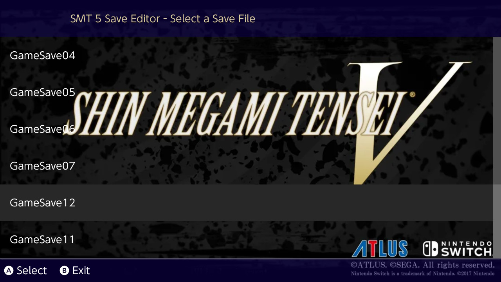

# SMT 5 Save Editor 

Source Code coming soon. (as soon as I remove the AES keys and add library submodules properly)

Supports:
- No decryption required!
- General Player Info
- Player Stats
- Player Items (not including relics)

# Instructions
1. Open the nro
2. Select a region if it prompts you to. (We have to load saves from one or another and I detected that you have both).
2. Select a save file.
3. Make your changes
4. Press `+` to apply your changes
6. Play your hacked game

# Credits
- https://github.com/supremetakoyaki/Aogami
    - Early Offsets
- Amuyea https://gbatemp.net/members/amuyea.437000/
    - For his work on initially documenting the save and setting up the discord server
    - https://docs.google.com/spreadsheets/d/1poQgijkzhdIOyKthD9kpiW1ZVC2Qr-eomUE0tCOJ2KE/edit#gid=480151356
- Everyone @ SMTV Discord Server
    - For literally all of the offsets
- https://github.com/FlagBrew/Checkpoint
    - Accounts and Save Loading

